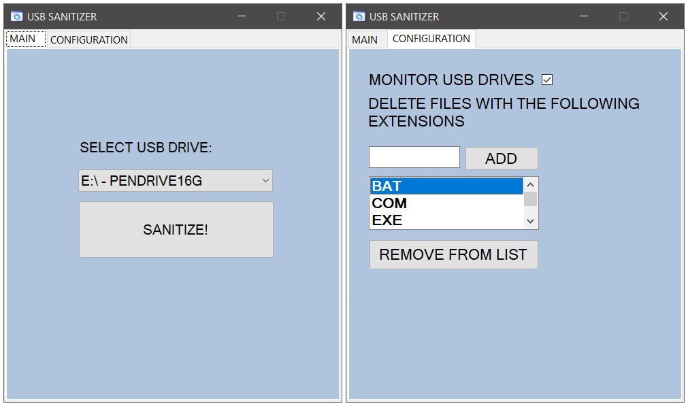

# USB Sanitizer

USB Sanitizer recursively scans USB drives to remove invalid file attributes and deletes files according to the extensions specified in a black list. This is useful for devices infected with the shortcut virus.

## Screenshots

## Resources

- *[Windows Forms documentation](https://learn.microsoft.com/en-us/dotnet/desktop/winforms/)*
